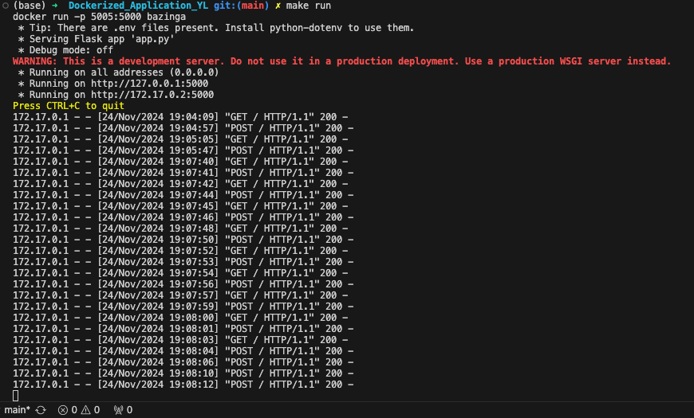

# Dockerized_Application_YL

## Purpose
Create a simple python application containerized with a dockerfile. The goal here is to both demonstrate running your application within a docker container (using docker run terminal commands) but to also build a docker image in your CI/CD pipeline which will be pushed to Docker Hub or other container management service.

## Requirements
- Application Functionality
    The python application works as intended

- Docker Configuration
    Dockerfile is configured correctly and results in a functional Docker image

- Container Service CI/CD
    CI/CD builds a container image and pushes that to a container management service.

## App Use
This project "Bazinga" is a number-guessing game, utilizing Docker for effective containerization. Here is a brief workflow overview of the Flask web application:

1. Number Generation: The app generates an integer between 1 and 10.
2. User Input: Individuals input an integer between 1 and 10 to guess what the answer is.
3. Answer Match: The application compare the number randomly generated and the number input.
4. Comparison Output: The web application then presents the result of the comparison.

## Github Actions
Makefile & CICD: The workflow includes running a Makefile to perform tasks such as `make build` and `make run`.

## Docker Containerization
This Dockerfile containerizes a Flask app, setting up a Docker container with Python to run the web application. It encapsulates the app's code and dependencies, simplifying deployment across different environments.

# Demo of the app
1. Setup and run locally: run the following code in the terminal

2. Copy and paste the link the above output and put into a search engine, then it takes us to the application

# Demo website
1. input an integer between 1 and 10

2. click `submit` and see the result
    - if the number input is the same as the number generated, you will see
    
    - if the number input is different from the number generated, you will see
    
3. We see the requests coming in from our terminal as we interact with the application
    